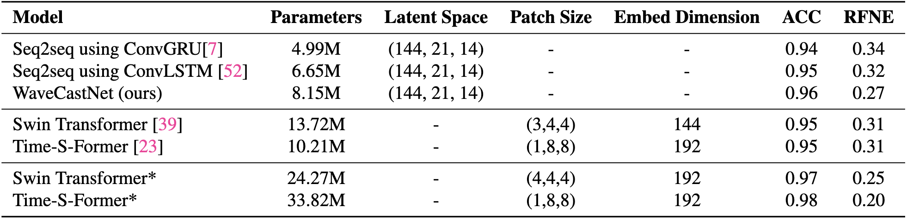

## WaveCastNet: An AI-enabled Wavefield Forecasting Framework for Earthquake Early Warning
Preprint Available At: [https://arxiv.org/abs/2405.20516](https://arxiv.org/abs/2405.20516)
### Overview
WaveCastNet is an AI-driven framework designed to forecast high-resolution wavefields, using convolutional Long Expressive Memory (ConvLEM) within a sequence-to-sequence architecture. By capturing long-term dependencies and multi-scale patterns across space and time, it delivers rapid, accurate predictions without relying on traditional earthquake magnitude or epicenter estimations.

<p align="center">
    
</p>
<b>Figure 1:</b> Illustration of the problem setup: (a) Synthetic data simulation area in the San Francisco Bay Area. (b) Snapshot of the viscoelastic velocity wavefield generated by a point-source earthquake.

### Highlights
- **Point-source prediction with uncertainty estimation**
    - Generate 100-second prediction from 5.6-second input
- **Robust evaluation under various noise tests**
    - Empirical noise
    - Gaussian noise
    - Arrival latency noise
- **Generalization to finite-fault settings**
- **Comparative study against transformer-based models**
- **Zero-shot generalization from synthetic data to real-world examples**

### Data Availability

The wavefield data can be accessed via [Google Drive](https://drive.google.com/drive/folders/10pe6Zc1NEzIunwJv80214dB9fmb-X8yw?usp=drive_link):

- `all_input.npy`: Training data from 300 events (80%).
- `{all_validation.npy, all_test.npy}`: Validation data from 45 events and test data from 30 events (20%).
- `mean.npy`: Per-pixel mean of the training data for normalization.
- `std.npy`: Per-pixel standard deviation of the training data for normalization.

All data has been preprocessed, normalized per pixel, and cropped to remove boundary artifacts. Each sequence has a shape of $3 \times 344 \times 224 \times 461$ ($\text{Channel} \times H \times W \times \text{Seq\_len}$).


## Model Structure
<p align="center" width="100%">
    
    
</p>
<b>Figure 2:</b> Sequence-to-sequence architecture supporting both dense image inputs (i) and sparse vector inputs (ii) for generating high-resolution predictions (Left). Convolutional Long Expressive Memory (ConvLEM) Cell structure (Right).

<p align="center">
    
</p>
<b>Table 1:</b> Main performance Metrics for the dense and sparse sampling point-source scenarios.

<p align="center" width="100%">
    
</p>
<b>Figure 3:</b> Examples of point-source time series visualizations.

- Dense Sampling Uncertainty Estimation: Ensemble prediction using 50 trained models
- Sparse Sampling Uncertainty Estimation: Ensemble prediction with 50 randomly sampled station sets based on a trained Masked Autoencoder
<p align="center" width="100%">
    
    
</p>

**Figure 4:** Peak Ground Velocity (PGV) and $T_{PGV}$ mean predictions ((a), (d)), absolute errors ((b), (e)), and standard deviations ((c), (f)) for dense (left) and sparse (right) sampling scenarios.

### Dense and Sparse Sampling Scenarios Training
```
python WaveCastNet/earthquake_train.py --model LEM_dense --num_kernels 144 --activation tanh --batch_size 64 --learning_rate 5e-4 #Dense Sampling

python WaveCastNet/earthquake_train.py --model LEM_sparse --num_kernels 144 --activation tanh --batch_size 64 --learning_rate 5e-4 #Sparse Sampling
```

### Uncertainty Quantification Training
```
python /global/homes/d/dwlyu/WaveCastNet/earthquake_train.py --model LEM_dense --num_kernels 144 --activation tanh --batch_size 64 --learning_rate 5e-4 --training_uq 1 --load_seed 2
```

## Finite Fault Generalization
<p align="center" width="100%">
    
    
</p>
<b>Table 2:</b> Systematic evaluation on higher-magnitude finite-fault earthquakes (Left). Performance comparison between seq2seq frameworks using different recurrent cells, and state-of-the-art transformers for forecasting small point-source earthquakes (Right).

### Seq2Seq Ablation Studies
```
python earthquake_train.py --model LEM --num_kernels 144 --activation tanh --batch_size 64 --learning_rate 5e-4

python earthquake_train.py --model LSTM --num_kernels 144 --activation tanh --batch_size 64 --learning_rate 5e-4

python earthquake_train.py --model GRU --num_kernels 144 --activation tanh --batch_size 64 --learning_rate 5e-4
```
### Comparative Studies with Transformer Architectures
```
python earthquake_train.py --model Swin --num_kernels 144 --patch_size 3 4 4 --batch_size 64 --learning_rate 5e-4

python earthquake_train.py --model Time-s-pyramid --num_kernels 192 --patch_size 1 8 8 --batch_size 64 --learning_rate 5e-4 # Time-S-Former

python earthquake_train.py --model Time-s-plain --num_kernels 192 --patch_size 1 8 8 --batch_size 64 --learning_rate 5e-4 # Video Swin Transformer
```
## Zero-shot Real-world Generalizaion
- **Example Event:** Berkeley 2018 **M4.4** Event at the depth of 12.3 km recorded by **178 stations**.
- **Model:** Sparse sampling model trained exclusively on **synthetic point-source** simulations
- **One-time prediction:** Generates a **full 110-second** high-resolution sequence in one step.
- **Rolling predicton:** Predicts **the next 15.6-second** segment using the current input and repeats the process for six steps.

<p align="center" width="100%">
    
    
</p>

**Figure 5:** Examples of real-world time series (Left): San Jose (NP.1788) and Woodside (BK.JRSC). High-resolution PGV and $T_{PGV}$ predictions (Right).


## Experiments in Appendix

### Train Moving MNIST

```
export CUDA_VISIBLE_DEVICES=4; python MovingMnist_train.py --model LEM -lr 5e-4 --num_layers 3 --width 64
export CUDA_VISIBLE_DEVICES=4; python MovingMnist_train.py --model LSTM -lr 5e-4 --num_layers 3 --width 64
export CUDA_VISIBLE_DEVICES=4; python MovingMnist_train.py --model QRNN -lr 5e-4 --num_layers 3 --width 64
```

### Train RBC Fluid Flow
```
python RBC_train.py --model LEM -lr 5e-4 --width 72 --activation tanh --input_steps 50 --future_steps 50
python RBC_train.py --model LSTM -lr 5e-4 --width 72 --activation tanh --input_steps 50 --future_steps 50
python RBC_train.py --model QRNN -lr 5e-4 --width 72 --activation tanh --input_steps 50 --future_steps 50
```
